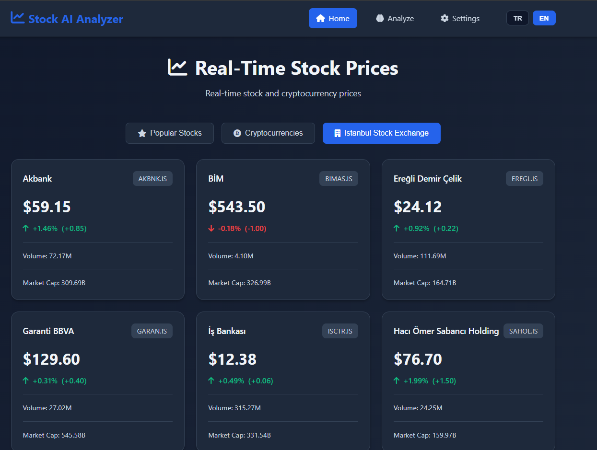
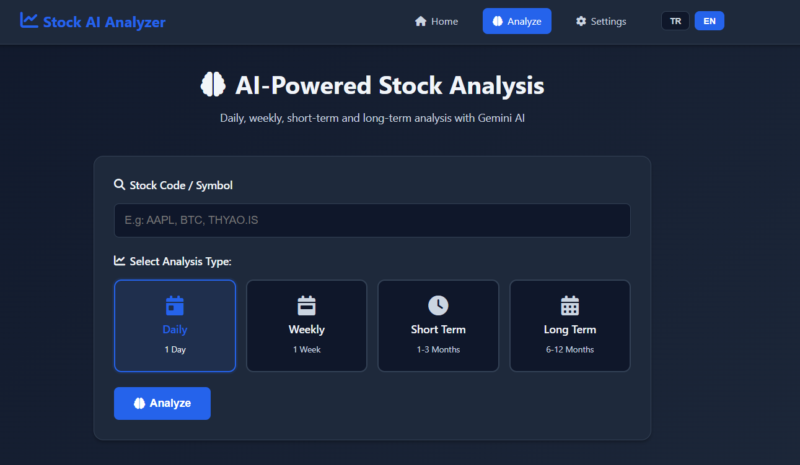
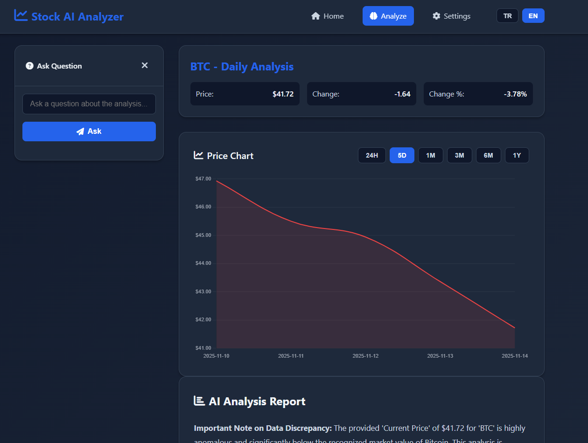
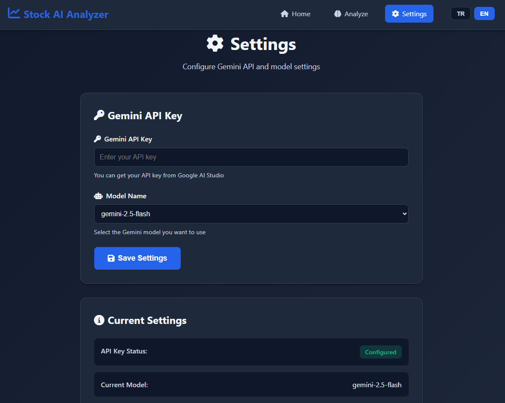

# Stock AI Analyzer

A modern and aesthetic stock market analysis application. Displays real-time prices for popular stocks, cryptocurrencies, and Istanbul Stock Exchange, and provides detailed analysis using Gemini AI.

## Screenshots

### Home Page


### Analysis Page



### Settings Page


## Features

- 📊 **Real-Time Prices**: Live prices for popular stocks, cryptocurrencies, and Istanbul Stock Exchange
- 🤖 **AI Analysis**: Short-term and long-term analysis, risk assessment using Gemini AI
- 📈 **Multiple Analysis Types**: Daily, weekly, short-term (1-3 months), and long-term (6-12 months) analysis
- 💬 **Interactive Q&A**: Ask follow-up questions about the analysis
- ⚙️ **Settings**: Manage API key and model name through the application
- 🌐 **Multi-Language**: Support for English and Turkish
- 🎨 **Modern UI**: Aesthetic and user-friendly interface with dark theme

## Project Structure

```
stockmarket/
├── app.py                 # Main Flask application
├── config.py              # Configuration and constants
├── requirements.txt       # Python dependencies
├── .env                   # Environment variables (to be created)
├── .env.example           # Example environment variables
├── services/              # Service layer
│   ├── stock_service.py   # Stock price service
│   ├── crypto_service.py  # Cryptocurrency price service
│   ├── gemini_service.py  # Gemini AI analysis service
│   └── settings_service.py # Settings management service
├── routes/                # Routes (Blueprints)
│   ├── pages.py           # Page routes
│   ├── prices.py          # Price API routes
│   ├── analysis.py        # Analysis API routes
│   └── settings.py         # Settings API routes
├── templates/             # HTML templates
└── static/                # CSS, JS, images
    ├── css/
    └── js/
```

## Installation

1. Install dependencies:
```bash
pip install -r requirements.txt
```

2. Create `.env` file:
```bash
cp .env.example .env
```

3. Edit `.env` file and add your Gemini API key:
```
GEMINI_API_KEY=your_api_key_here
GEMINI_MODEL=gemini-2.5-flash
```

## Running

```bash
python app.py
```

The application will run at `http://localhost:5000`.

## API Endpoints

### Price Endpoints
- `GET /api/prices/popular` - Popular stocks
- `GET /api/prices/crypto` - Popular cryptocurrencies
- `GET /api/prices/borsa-istanbul` - Istanbul Stock Exchange stocks
- `GET /api/prices/<symbol>` - Price for a specific symbol

### Analysis Endpoints
- `POST /api/analyze` - Analyze with Gemini AI
  ```json
  {
    "symbol": "AAPL",
    "analysis_type": "short_term",
    "language": "en"
  }
  ```
  Analysis types: `daily`, `weekly`, `short_term`, `long_term`

- `POST /api/ask-question` - Ask a follow-up question
  ```json
  {
    "symbol": "AAPL",
    "question": "What are the main risks?",
    "analysis_text": "...",
    "price_data": {...},
    "language": "en"
  }
  ```

### Settings Endpoints
- `GET /api/settings` - Get current settings
- `POST /api/settings` - Update settings
  ```json
  {
    "api_key": "your_api_key",
    "model": "gemini-2.5-flash"
  }
  ```

## Technologies Used

- **Flask**: Web framework
- **yfinance**: Yahoo Finance API
- **ccxt**: Cryptocurrency exchanges API
- **Google Generative AI**: Gemini AI integration
- **Python-dotenv**: Environment variables management

## License

MIT

---

# Stock AI Analyzer

Modern ve estetik bir borsa analiz uygulaması. Popüler hisse senetleri, kripto paralar ve Borsa İstanbul'dan anlık fiyatları gösterir ve Gemini AI ile detaylı analiz yapar.

## Ekran Görüntüleri

### Anasayfa


### Analiz Sayfası


### Ayarlar Sayfası


## Özellikler

- 📊 **Anlık Fiyatlar**: Popüler hisse senetleri, kripto paralar ve Borsa İstanbul için gerçek zamanlı fiyatlar
- 🤖 **AI Analiz**: Gemini AI ile kısa ve uzun vadeli analiz, risk değerlendirmesi
- 📈 **Çoklu Analiz Türleri**: Günlük, haftalık, kısa vade (1-3 ay) ve uzun vade (6-12 ay) analiz
- 💬 **İnteraktif Soru-Cevap**: Analiz hakkında takip soruları sorabilme
- ⚙️ **Ayarlar**: API anahtarı ve model adını uygulama üzerinden yönetme
- 🌐 **Çok Dilli**: İngilizce ve Türkçe desteği
- 🎨 **Modern UI**: Estetik ve kullanıcı dostu arayüz, koyu tema

## Proje Yapısı

```
stockmarket/
├── app.py                 # Ana Flask uygulaması
├── config.py              # Konfigürasyon ve sabitler
├── requirements.txt       # Python bağımlılıkları
├── .env                   # Ortam değişkenleri (oluşturulacak)
├── .env.example           # Örnek ortam değişkenleri
├── services/              # Servis katmanı
│   ├── stock_service.py   # Hisse senedi fiyat servisi
│   ├── crypto_service.py  # Kripto para fiyat servisi
│   ├── gemini_service.py  # Gemini AI analiz servisi
│   └── settings_service.py # Ayarlar yönetim servisi
├── routes/                # Route'lar (Blueprint'ler)
│   ├── pages.py           # Sayfa route'ları
│   ├── prices.py          # Fiyat API route'ları
│   ├── analysis.py        # Analiz API route'ları
│   └── settings.py        # Ayarlar API route'ları
├── templates/             # HTML şablonları
└── static/                # CSS, JS, görseller
    ├── css/
    └── js/
```

## Kurulum

1. Bağımlılıkları yükleyin:
```bash
pip install -r requirements.txt
```

2. `.env` dosyası oluşturun:
```bash
cp .env.example .env
```

3. `.env` dosyasını düzenleyip Gemini API anahtarınızı ekleyin:
```
GEMINI_API_KEY=your_api_key_here
GEMINI_MODEL=gemini-2.5-flash
```

## Çalıştırma

```bash
python app.py
```

Uygulama `http://localhost:5000` adresinde çalışacaktır.

## API Endpoints

### Fiyat Endpoints
- `GET /api/prices/popular` - Popüler hisse senetleri
- `GET /api/prices/crypto` - Popüler kripto paralar
- `GET /api/prices/borsa-istanbul` - Borsa İstanbul hisseleri
- `GET /api/prices/<symbol>` - Belirli bir sembol için fiyat

### Analiz Endpoints
- `POST /api/analyze` - Gemini AI ile analiz yap
  ```json
  {
    "symbol": "AAPL",
    "analysis_type": "short_term",
    "language": "tr"
  }
  ```
  Analiz türleri: `daily`, `weekly`, `short_term`, `long_term`

- `POST /api/ask-question` - Takip sorusu sor
  ```json
  {
    "symbol": "AAPL",
    "question": "Ana riskler nelerdir?",
    "analysis_text": "...",
    "price_data": {...},
    "language": "tr"
  }
  ```

### Ayarlar Endpoints
- `GET /api/settings` - Mevcut ayarları getir
- `POST /api/settings` - Ayarları güncelle
  ```json
  {
    "api_key": "your_api_key",
    "model": "gemini-2.5-flash"
  }
  ```

## Kullanılan Teknolojiler

- **Flask**: Web framework
- **yfinance**: Yahoo Finance API
- **ccxt**: Kripto para borsaları API
- **Google Generative AI**: Gemini AI entegrasyonu
- **Python-dotenv**: Ortam değişkenleri yönetimi

## Lisans

MIT
